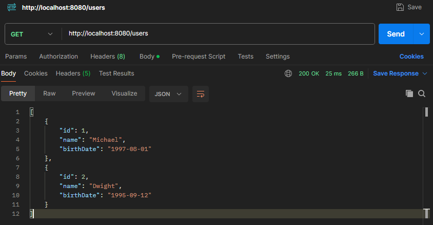
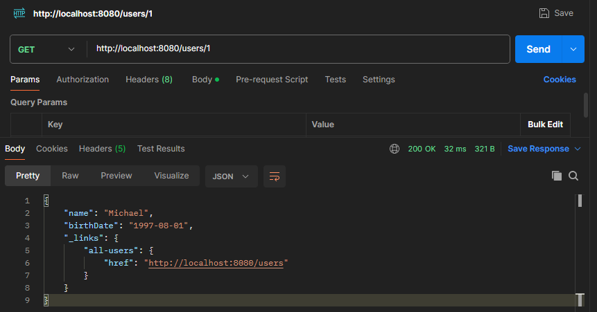
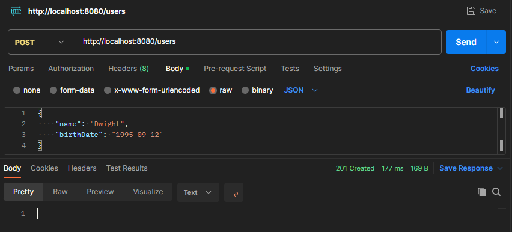
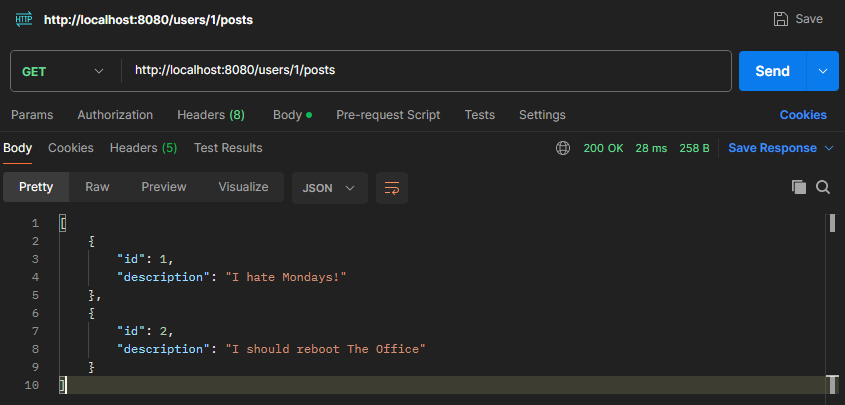
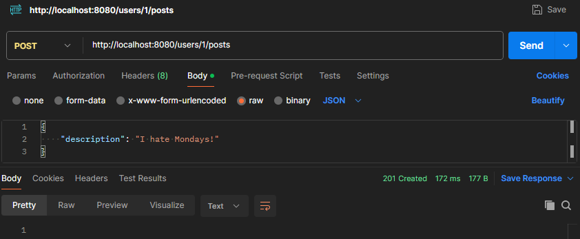
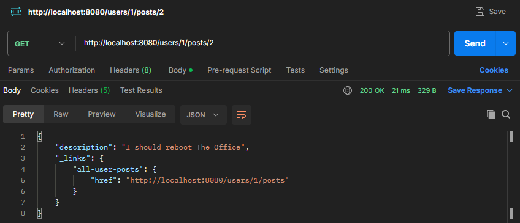
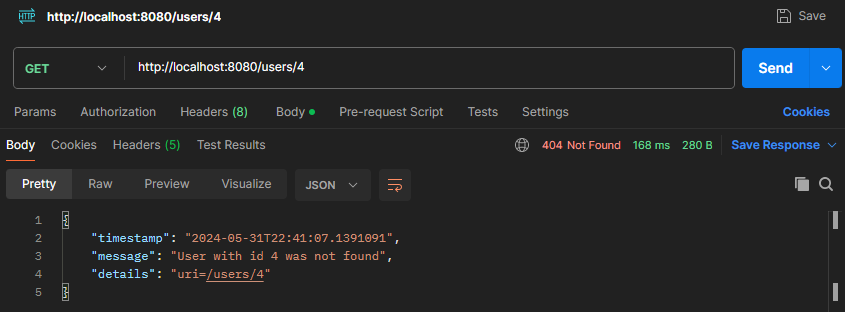
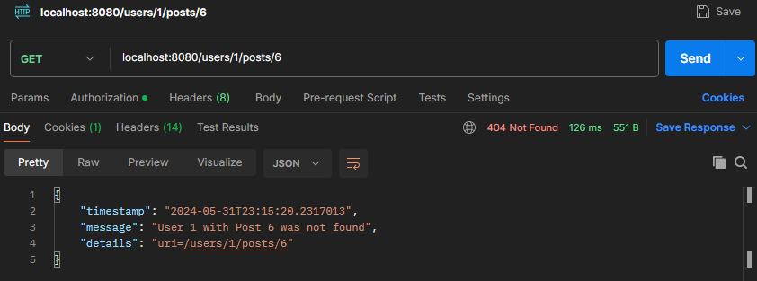
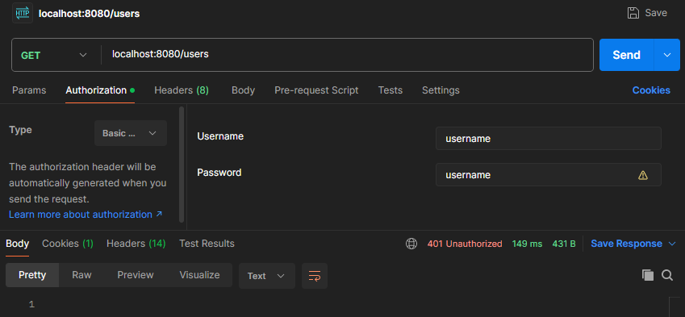
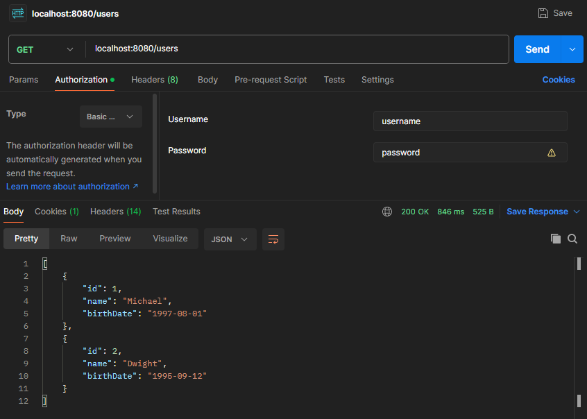

# Social Media API - RESTful API with Spring

This learning project, inspired by the Udemy course [Master Spring Boot 3 & Spring Framework 6 with Java](https://www.udemy.com/course/spring-boot-and-spring-framework-tutorial-for-beginners/), demonstrates the core concepts of Spring Boot, Spring Framework, Spring Security, and Spring Data JPA in the development of a basic restful api.

### Prerequisites

To use this project, you need to have knowledge of:

+ Java - Object Oriented Programming Language.
+ Spring Boot - Create stand-alone Spring applications.
+ Postman - API testing platform.

### Installing the Project

To download this project, run the following command down below.

```
git clone https://github.com/JuanPablo70/SocialMedia-REST-API.git
```

Install Docker Desktop and execute this command to launch MySQL as Docker Container:

```
docker run --detach --env MYSQL_ROOT_PASSWORD=dummypassword --env MYSQL_USER=social-media-user --env MYSQL_PASSWORD=dummypassword --env MYSQL_DATABASE=social-media-database --name mysql --publish 3306:3306 mysql:8-oracle
```

Open a terminal in the project directory and run the following command:

```
./mvnw spring-boot:run
```

Use Postman or any other API testing tool to start making requests at [localhost:8080/users](localhost:8080/users).

### About this Project

This project is a RESTful API for a social network, developed to provide basic functionalities for user and post management. The API offers a series of endpoints that allow various operations related to users and their posts.

#### Endpoints

+ Get All Users ```/users```: Allows retrieving a list of all users.

    

+ Get User by ID ```/users/{id}```: Allows retrieving the details of a specific user by their ID.

    

+ Create User ```/users```: Allows registering a new user in the system.

    

+ Delete User ```/users/{id}```: Allows deleting an existing user by their ID.

+ Get Posts by User ID ```/users/{id}/posts```: Allows retrieving all posts made by a specific user.

    

+ Create Post for User ```/users/{id}/posts```: Allows adding a new post to a specific user.

    

+ Get Specific Post by User ID ```/users/{id}/posts/{id}```: Allows retrieving the details of a specific post from a specific user.

    

#### Development Details

During the development of this API, the following tasks were performed:

+ User Controller: Created a user controller that provides the aforementioned endpoints, handling GET, POST, and DELETE requests.

+ Exception Handling: Implemented exception handling to return a 404 error when a resource is not found.

    

    

+ Validations with Spring: Integrated validations using Spring to ensure data integrity  using ```@Size``` annotation in the name and ```@Past``` in the birthdate.

+ Documentation with Swagger: Used Swagger to generate the API documentation, facilitating its understanding and use. To access the documentation, go to [localhost:8080/swagger-ui/index.html](localhost:8080/swagger-ui/index.html).

+ Content Negotiation: Implemented content negotiation to support XML response formats.

    ```
      <dependency>
        <groupId>com.fasterxml.jackson.dataformat</groupId>
        <artifactId>jackson-dataformat-xml</artifactId>
      </dependency>
    ```

+ HATEOAS: Integrated HATEOAS to provide navigation links in the API responses.

+ Spring Boot Actuator: Implemented Spring Boot Actuator to monitor and manage the application. To monitor the API go to [localhost:8080/actuator](localhost:8080/actuator).

    ```
      <dependency>
        <groupId>org.springframework.boot</groupId>
        <artifactId>spring-boot-starter-actuator</artifactId>
      </dependency>
    ```

+ Basic Authentication: Implemented basic authentication using Spring Security to protect the API endpoints.

    

    

+ Database in Docker: The information is stored in a database created and managed in a Docker container, ensuring a consistent development and production environment.

### Build With

+ [Spring Initializr](https://start.spring.io) - Tool used to set up Spring Boot projects.
+ [Maven](https://maven.apache.org) - Software project management and comprehension tool.
+ [Docker](https://www.docker.com) - Accelerated container application development.

### Version

1.0

### Author

[Juan Pablo Sánchez Bermúdez](https://github.com/JuanPablo70)

